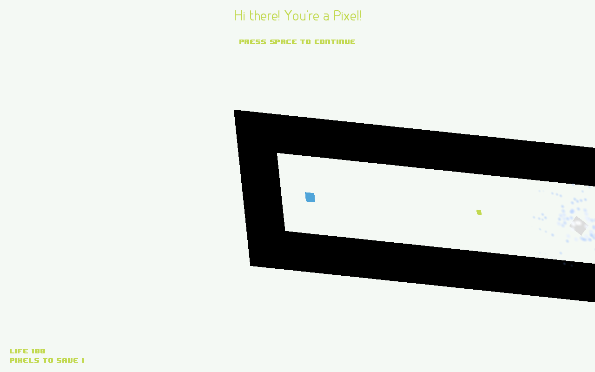

Save the Pixles
===============

Save the Pixles is an experiment using Lua and the [Love2D](http://love2d.org) game engine.

<iframe width="640" height="480" src="http://www.youtube.com/embed/-P-0U3DqIOc" frameborder="0" allowfullscreen></iframe>

Licensing
---------
StP is released under the MIT License.